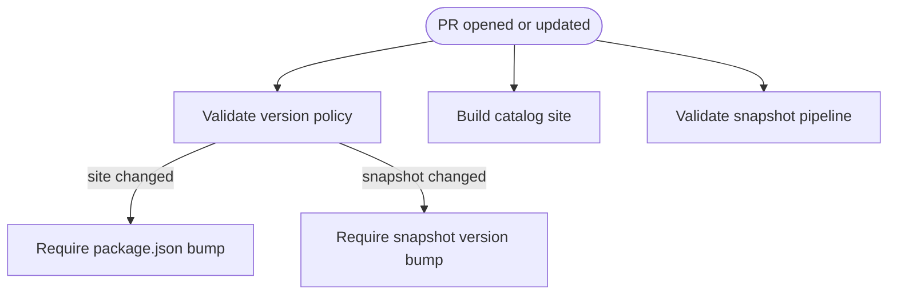
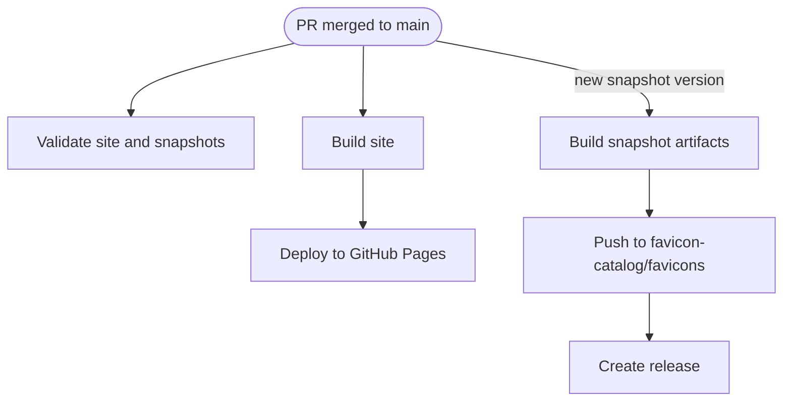

# Favicon Catalog

This repository (`favicon-catalog.github.io`) is the main source repository for the Favicon Catalog project.
It hosts the catalog site at `https://favicon-catalog.github.io/` and owns the project documentation, site code, and published snapshot integration.

Snapshot data is published from the [favicons](https://github.com/favicon-catalog/favicons) repository.
Snapshot source files also live under [`snapshot/`](/root/ws/favicon-catalog/favicon-catalog.github.io/snapshot/domains.txt) inside this repository.

## How To Use

Browse the published catalog at:

```text
https://favicon-catalog.github.io/
```

To consume published snapshot data directly, use:

```text
https://cdn.jsdelivr.net/gh/favicon-catalog/favicons@<tag>/index.json
https://cdn.jsdelivr.net/gh/favicon-catalog/favicons@<tag>/<first-char>/<domain>/favicon.png
https://raw.githubusercontent.com/favicon-catalog/favicons/<tag>/index.json
https://favicon-catalog.github.io/favicons/index.json
https://favicon-catalog.github.io/favicons/<first-char>/<domain>/favicon.png
```

Use `index.json` to enumerate published domains. Use the representative PNG path when you need one stable favicon image per domain.

The catalog provides search, pagination, and direct links to each domain's representative PNG and manifest.
It also provides per-domain detail pages, JSON dialogs for `index.json` and per-domain manifests, and direct download/copy actions.

Current catalog behavior:

- list and detail views
- URL-synced detail pages such as `/apps.apple.com`
- search with compact match summary
- direct download links for individual icon files
- manifest and index dialogs with `Copy`, `Download`, and `Close` actions
- clickable URLs inside JSON dialogs
- related domain navigation in the detail view
- brand logo and site favicon provided by `site/public/logo.svg`

## Catalog UI

The published catalog is a static site built from `site/` and served via GitHub Pages at root domain.

Main interactions:

- search field with list/detail view toggle
- detail pages with route-backed URLs
- manifest trigger from the detail header
- related domains section in detail view
- JSON dialogs render URL strings as clickable links that open in a new tab

Detail routes use the published base path plus the encoded domain:

```text
/<domain>
```

Example:

```text
https://favicon-catalog.github.io/apps.apple.com
```

## Local Development

For local development, install dependencies and start the Vite dev server:

```bash
npm install
npm run dev
```

That serves the catalog locally (usually at `http://localhost:5173/`). By default, the application fetches snapshot data from `https://favicon-catalog.github.io/favicons/`. 

To use local snapshots, test the `VITE_SNAPSHOT_BASE_URL` environment variable.

Common site commands:

```bash
npm run dev
npm run build
npm run preview
```

## Maintain Snapshots

The snapshot source of truth lives under `snapshot/`.

Run `make check` before opening a pull request. It performs the same repository-level checks enforced by the `Validate` workflow in CI.

Use these commands when working on snapshot data and release logic:

```bash
make -C snapshot validate
make -C snapshot test
make -C snapshot release
```

Common maintenance entry points:

- domain list: [`snapshot/domains.txt`](/root/ws/favicon-catalog/favicon-catalog.github.io/snapshot/domains.txt)
- snapshot version: [`snapshot/SNAPSHOT_VERSION`](/root/ws/favicon-catalog/favicon-catalog.github.io/snapshot/SNAPSHOT_VERSION)
- snapshot commands: [`snapshot/Makefile`](/root/ws/favicon-catalog/favicon-catalog.github.io/snapshot/Makefile)
- pipeline code: [`snapshot/src/`](/root/ws/favicon-catalog/favicon-catalog.github.io/snapshot/src/cli.js)

To add or update domains, edit [`snapshot/domains.txt`](/root/ws/favicon-catalog/favicon-catalog.github.io/snapshot/domains.txt) and open a pull request. Run `make check` before opening the PR if you want to validate the same local checks enforced in CI.

The published snapshot repository at [favicons](https://github.com/favicon-catalog/favicons) is an artifact endpoint. Its published `README.md` is copied from [snapshot/README.md](/root/ws/favicon-catalog/favicon-catalog.github.io/snapshot/README.md), and its published license is copied from the repository root [LICENSE](/root/ws/favicon-catalog/favicon-catalog.github.io/LICENSE).

Snapshot release model:

- source pipeline under `snapshot/`
- published artifacts in `favicon-catalog/favicons`
- snapshot version owned by [`snapshot/SNAPSHOT_VERSION`](/root/ws/favicon-catalog/favicon-catalog.github.io/snapshot/SNAPSHOT_VERSION)

## CI/CD Workflows

Our GitHub Actions workflows are designed around the standard lifecycle of a change: from proposing a change via a Pull Request to automatically releasing it on merge.

### 1. On Pull Request
When you open or update a Pull Request, the **Validate** workflow runs automatically to ensure your changes are safe to merge.

- **Site Build Check:** Verifies that the catalog site and its Vite configuration build successfully.
- **Snapshot Validation:** Runs internal checks (equivalent to `make check`) on the snapshot pipeline to ensure data integrity.
- **Version Policy Enforcement:** Ensures proper version tracking based on what you modified:
  - Changes to the catalog site (`site/` or `vite.config.js`) require a version bump in `package.json`.
  - Changes to snapshot data (`snapshot/domains.txt`, `snapshot/src/`, etc.) require a version bump in `snapshot/SNAPSHOT_VERSION`.



### 2. On Merge to `main`
Once your Pull Request is approved and merged into the `main` branch (or code is pushed directly), the repository automatically tests the `main` branch, deploys the site, and publishes a new snapshot if needed.

- **Final Validation:** Runs the site build and snapshot validation checks again to ensure the `main` branch remains stable.
- **Site Deployment:** The **Deploy** workflow builds the static catalog site and publishes it directly to [GitHub Pages](https://favicon-catalog.github.io/).
- **Snapshot Publishing:** The **Publish** workflow checks the current `snapshot/SNAPSHOT_VERSION`. If that version tag hasn't been published yet to the external [`favicon-catalog/favicons`](https://github.com/favicon-catalog/favicons) repository, it generates the new snapshot artifacts and creates a new release automatically. (Publishing can also be triggered manually via `workflow_dispatch` if needed).



## Notes

Favicons referenced by this project may be trademarks of their respective owners, and no affiliation with or endorsement by those owners is implied.
